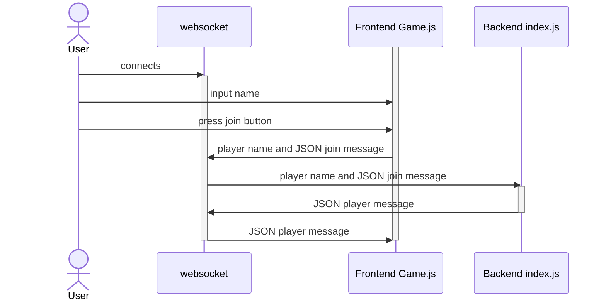
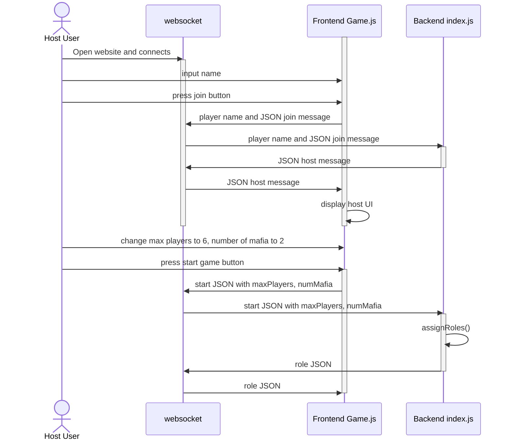
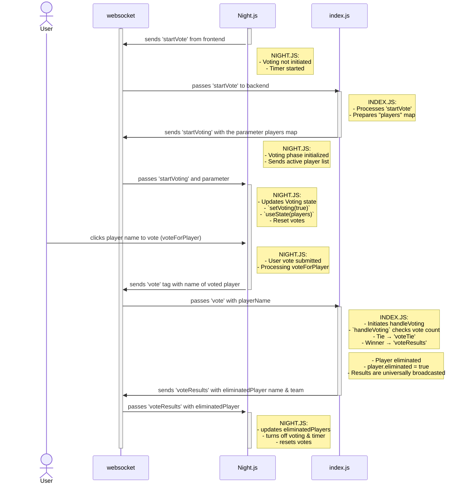
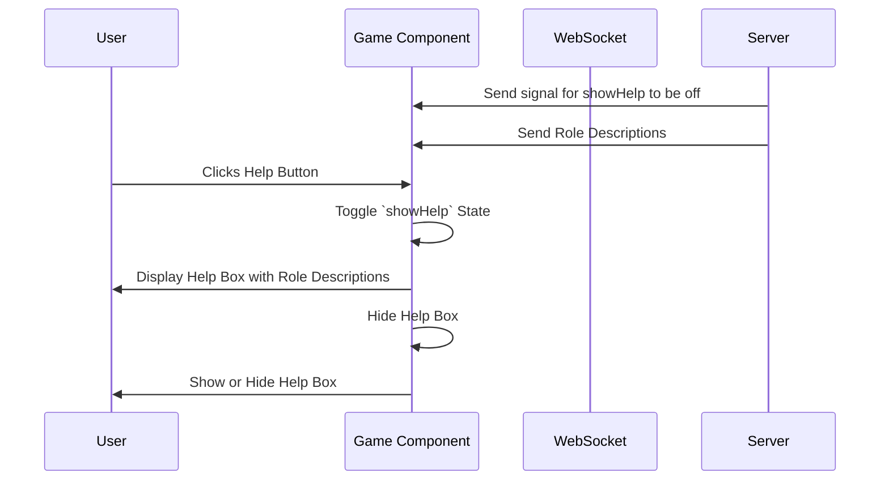

[](https://classroom.github.com/open-in-codespaces?assignment_repo_id=16933133)
<div align="center">

# Mafia Uhh
[](https://temple-cis-projects-in-cs.atlassian.net/jira/software/c/projects/DT/issues)
[](https://github.com/ApplebaumIan/tu-cis-4398-docs-template/actions/workflows/deploy.yml)
[](https://applebaumian.github.io/tu-cis-4398-docs-template/)


</div>

## Project Abstract

This document proposes a real-time multiplayer game application based on the classic party game "Mafia" that combines interactive gameplay with several dynamic features. The system allows Users to connect and participate via WebSocket connections between a React-based frontend client and a backend Node.js server. Upon joining, the first player is designated as the Host with unique capabilities. Upon game start, each player is randomly assigned a unique role such as "Mafia" or "Citizen" from a pre-defined pool; the roles have different win conditions and strategy. The players go through a series of Day and Night voting phases to eliminate players and eventually determine a winning team. 

## Features
- multi-User interactive game
- game hosted through localhost
- custom player name selection in Join Menu
- variable Host capabilities and Host Menu in Startup Lobby
- customizable game settings in Startup Lobby
- dynamically updated Current Players list and display
- Help Button popup that lists out the roles with descriptions
- randomly assigned role distribution system
- custom art and pictures for each role (Civilian & Mafia)
- custom Narration functionality (British)
- universally-synced game properties (Start Game, phase switches, timer countdown, etc.)
- timer countdown display during both game phases: Day & Night
- Show Role popup that lists the user's role to them locally
- dynamic voting functionality
- dynamically updated Alive Players and Eliminated Players lists and pop-up displays
- intermission pages / phases between Day & Night phases
- Eliminated Players page for dead players while game is active
- real-time Win Condition monitoring
- Game Over page for when the game is complete

## Keywords

[CIS 3296]<br>
Section 005<br>
Software Design (Applebaum & Thanh)<br>
2024 Fall<br>

Mafia Game (Recreation and Implementation)<br>

Javascript<br>
Node.js<br>
React<br>
CSS<br>
.mp3<br>
Web-app & Mobile app<br>
VSCode<br>
Github<br>

## Required Resources

Github<br>
VSCode or Preferred IDE<br>
Wifi-connected device<br>
Background knowledge on Javascript, CSS, Node.js, and React (ideal)<br>

## Installation

To run the project locally, clone the repository and install Node.js and some required dependencies:

### Step 1: Set Up the Project Environment
Load up your preferred IDE and Navigate to your preferred directory for the installation. Then clone the repo:
```bash
    git clone https://github.com/cis3296f24/applebaum-final-projects-mafia-uhh
```
Download the latest version of Node.js from the official website: "https://nodejs.org/en/download/package-manager". <br>
- Choose your system and either "Current" version or "LTS" (Long-Term Support) version.<br>

Next, run the installation wizard. Also make sure that you install Node.js in a directory above or at your preferred directory from before. Check the version of node and npm with:
```bash
    node -v
    npm -v
```
Navigate into the project directory and install the initial dependencies:
```bash
    cd applebaum-final-projects-mafia-uhh
    npm install
```
While still in the project directory, applebaum-final-projects-mafia-uhh, install these additional dependencies:
```bash
    npm install express
    npm install ws
    npm install concurrently --save-dev
```
Navigate to the client folder within the main project directory and install this last dependency:
```bash
    npm install react-router-dom
```

### Step 2: Run Project!
In your preferred IDE, navigate to the project directory:
```bash
    cd applebaum-final-projects-mafia-uhh
```
Then run the start script to begin the localhost and Game:
```bash
    npm start
```
In your browser, visit the localhost link to join the game.
- (the Host should see it in their console, while other users must manually type it into their browser)
```bash
    Local:            http://localhost:3000
    On Your Network:  http://192.111.11.1:3000
```
Enjoy!

## Use Case 1: Player Joining The Game


This sequence diagram shows a player joining the game. First the user will open the website and that will make a websocket connection. Then the User will input their name and press the join button on the frontend client screen Game.js. The Frontend Game.js sends this information to the websocket connection and then the websocket will send that information to the backend index.js. The Backend index.js will send the player message to the websocket connection, which will then send it to the Frontend Game.js where it will be displayed on the client.

## Use Case 2: Host Changing Options in Host Panel


This sequence diagram is for the use case of the Host, or the first person to connect to the game, changing options in the host options panel. The host user opens the website and connects to the websocket. The host enters their name and presses join, which causes the frontend to send a join message containing the player name to the backend. Since this is the first user to join, they are made the host. The backend sends a host message to the frontend via the websocket, which then triggers the frontend to display the host UI for the host only. Then the host changes max players to 6 and number of mafia to 2. Once they start the game, a start message is sent via websocket to the backend, where these variables are used to assignRoles() to all players. Using the websocket, the backend sends a role message to the frontend to display the role that each player got.

## Use Case 3: Player Selecting a Vote


This sequence diagram represents a player who is already in the game and can vote. The user is already has a websocket connection. The current state of the game is immediately after game status swapped from startGame.js to Night.js. The diagram demonstates the various communications between the frontend and backend of the game system through a websocket. At first, the voting is not started, but then the game updates to have voting begin (through various communications between backend and frontend to setup the initialization of voting). Following this, the User will be able to select the name of their target vote for elimination by clicking on their button on the frontend client screen of Night.js. The frontend will communicate their choice to the backend who will process it. The backend then sends the reponse to the voting results from all other users to each individual users frontend. The player has the name of the eliminated player displayed on their screen and finally voting and the timer are reset back to their initial states.

## Use Case 4: Player Toggles Help Button 


This sequence diagram represents a player who is already in the game. The user is already has a websocket connection. The current state of the game is immediately after they have joined the game. The diagram demonstates the various communications between the frontend and backend of the game system through a websocket. Initially, the backend has immediately already sent two signals to the user's frontend: one to toggle the help button to an off state, and another that contains the text data displayed in the help menu. So at first, the help button is not displayed (toggled off), but then the user clicks on the frontend display button which triggers a call to toggle the help button to on. The user's frontend swaps the useState condition for the toggleHelp button and then the help button pop-up is displayed on their screen.

## Collaborators

[//]: # ( readme: collaborators -start )
<table>
<tr>
    <td align="center">
        <a href="https://github.com/JohnDaang">
            
            <br />
            <sub><b>John Daang</b></sub>
        </a>
    </td>
    <td align="center">
        <a href="https://github.com/tur97019">
            
            <br />
            <sub><b>Cole Dirnbeck</b></sub>
        </a>
    </td>
    <td align="center">
        <a href="https://github.com/emholland">
            
            <br />
            <sub><b>Elisa Holladn</b></sub>
        </a>
    </td>
    <td align="center">
        <a href="https://github.com/tuo62395">
            
            <br />
            <sub><b>Isaac Schwartz</b></sub>
        </a>
    </td>
</tr>
</table>

[//]: # ( readme: collaborators -end )
