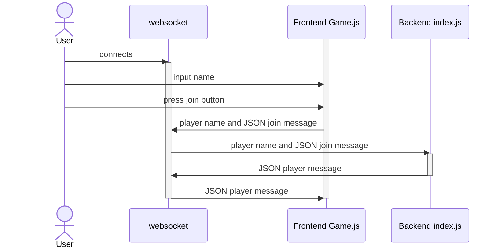
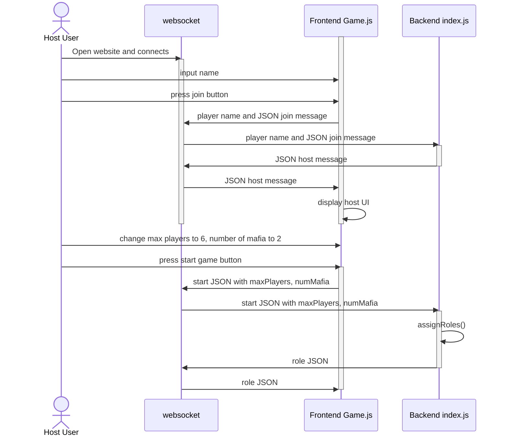
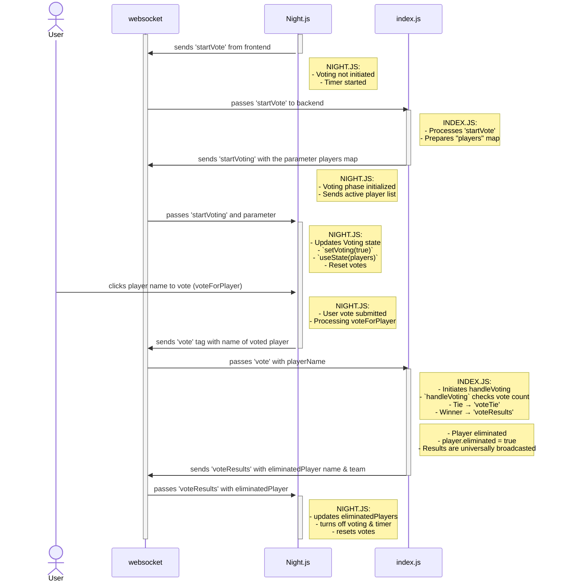

# Use-case descriptions

## Use Case 1: Player Joining The Game

This sequence diagram shows a player joining the game. First the user will open the website and that will make a websocket connection. Then the User will input their name and press the join button on the frontend client screen Game.js. The Frontend Game.js sends this information to the websocket connection and then the websocket will send that information to the backend index.js. The Backend index.js will send the player message to the websocket connection, which will then send it to the Frontend Game.js where it will be displayed on the client.

## Use Case 2: Host Changing Options in Host Panel

This sequence diagram is for the use case of the Host, or the first person to connect to the game, changing options in the host options panel. The host user opens the website and connects to the websocket. The host enters their name and presses join, which causes the frontend to send a join message containing the player name to the backend. Since this is the first user to join, they are made the host. The backend sends a host message to the frontend via the websocket, which then triggers the frontend to display the host UI for the host only. Then the host changes max players to 6 and number of mafia to 2. Once they start the game, a start message is sent via websocket to the backend, where these variables are used to assignRoles() to all players. Using the websocket, the backend sends a role message to the frontend to display the role that each player got.

## Use Case 3: Player Selecting a Vote

This sequence diagram represents a player who is already in the game and can vote. The user is already has a websocket connection. The current state of the game is immediately after game status swapped from startGame.js to Night.js. The diagram demonstates the various communications between the frontend and backend of the game system through a websocket. At first, the voting is not started, but then the game updates to have voting begin (through various communications between backend and frontend to setup the initialization of voting). Following this, the User will be able to select the name of their target vote for elimination by clicking on their button on the frontend client screen of Night.js. The frontend will communicate their choice to the backend who will process it. The backend then sends the reponse to the voting results from all other users to each individual users frontend. The player has the name of the eliminated player displayed on their screen and finally voting and the timer are reset back to their initial states.