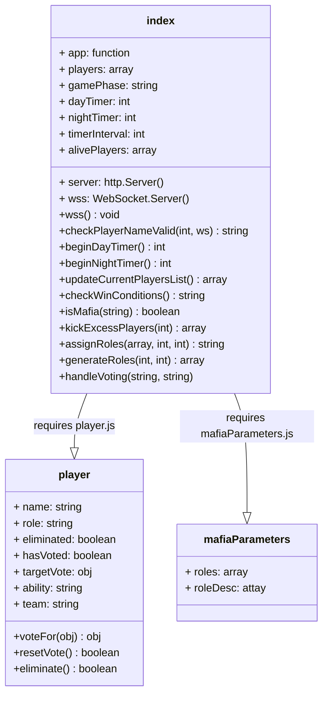
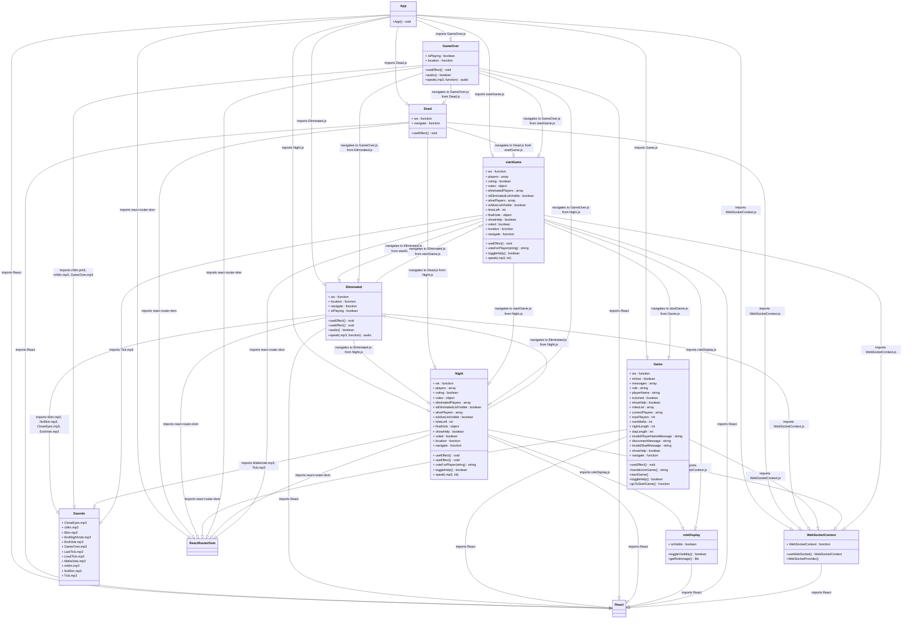

# System Diagrams

## Mafia-uhh Class Diagrams
  

### Backend Class Diagram

```mermaid
%% Define all Classes and Interfaces
classDiagram

%% Backend Classes (Modules / Files represent classes)
class index
class mafiaParameters
class player
 
%% Provide Attributes and Methods for Backend
class index {
    + app: function
    + server: http.Server()
    + wss: WebSocket.Server()
    + players: array
    + gamePhase: string
    + dayTimer: int
    + nightTimer: int
    + timerInterval: int
    + alivePlayers: array

    +wss() void
    +checkPlayerNameValid(int, ws) string
    +beginDayTimer() int
    +beginNightTimer() int
    +updateCurrentPlayersList() array
    +checkWinConditions() string
    +isMafia(string) boolean
    +kickExcessPlayers(int) array
    +assignRoles(array, int, int) string
    +generateRoles(int, int) array
    +handleVoting(string, string)
}
class mafiaParameters {
    + roles: array
    + roleDesc: attay
}
class player {
    + name: string
    + role: string
    + eliminated: boolean
    + hasVoted: boolean
    + targetVote: obj
    + ability: string
    + team: string

    +voteFor(obj) obj
    +resetVote() boolean
    +eliminate() boolean
}

%% Define Backend Relationships (between other backend modules)

index --|> player : requires player.js
index --|> mafiaParameters : requires mafiaParameters.js
```

### Frontend Class Diagram

```mermaid
%% Define all Classes and Interfaces
classDiagram

%% Frontend Classes
class App
class Dead
class Eliminated
class Game
class GameOver
class Night
class roleDisplay
class startGame
class WebSocketContext
class Sounds

%% Important dependencies that are used in the other classes/modules/files:
class React
class ReactRouterDom

%% Provide Attributes and Methods for Frontend
class App {
    +App() void
    %% links everything, all of the other frontend files
}
class Dead {
    + ws : function
    + navigate : function

    +useEffect() void
}
class Eliminated {
    + ws : function
    + location : function
    + navigate : function
    + isPlaying : boolean

    %% main useEffect
    +useEffect() void
    %% listens for: currentPhase, ws, nightLength, dayLength, playerName, isHost, navigate, role, rolesList
    +useEffect() void
    %% listens for: voted
    +audio() boolean
    +speak(.mp3, function) audio
}
class Game {
    + ws : function
    + isHost : boolean
    + messages : array
    + role : string
    + playerName : string
    + isJoined : boolean
    + showHelp : boolean
    + rolesList : array
    + currentPlayers : array
    + maxPlayers : int
    + numMafia : int
    + nightLength : int
    + dayLength : int
    + invalidPlayerNameMessage : string
    + disconnectMessage : string
    + invalidStartMessage : string
    + showHelp : boolean
    + navigate : function

    %% main useEffect
    +useEffect() void
    %% listens for: ws, navigate, role, playerName, isHost, currentPlayers, nightLength
    +handleJoinGame() string
    +startGame()
    +toggleHelp() boolean
    +goToStartGame() function
}
class GameOver {
    + isPlaying : boolean
    + location : function

    +useEffect() void
    %% listens for: winner
    +audio() boolean
    +speak(.mp3, function) audio
}
class Night {
    + ws : function
    + players : array
    + voting : boolean
    + votes : object
    + eliminatedPlayers : array
    + isEliminatedListVisible : boolean
    + alivePlayers : array
    + isAliveListVisible : boolean
    + timeLeft : int
    + finalVote : object
    + showHelp : boolean
    + voted : boolean
    + location : function
    + navigate : function

    %% main useEffect
    + useEffect() void
    %% listens for: ws, navigate, role, playerName, isHost, voting, nightLength, alivePlayers, dayLength, players, rolesList, voted
    + useEffect() void
    %% listens for: voted
    + voteForPlayer(string) string
    + toggleHelp() boolean
    + speak(.mp3, int)
}
class roleDisplay {
    + isVisible : boolean

    +toggleVisibility() boolean
    +getRoleImage() file
}
class startGame {
    + ws : function
    + players : array
    + voting : boolean
    + votes : object
    + eliminatedPlayers : array
    + isEliminatedListVisible : boolean
    + alivePlayers : array
    + isAliveListVisible : boolean
    + timeLeft : int
    + finalVote : object
    + showHelp : boolean
    + voted : boolean
    + location : function
    + navigate : function

    %% main useEffect
    + useEffect() void
    %% listens for: ws, navigate, role, playerName, isHost, eliminatedPlayers, players, voting, dayLength, nightLength, voted, alivePlayers, rolesList
    + voteForPlayer(string) string
    + toggleHelp() boolean
    + speak(.mp3, int)
}
class WebSocketContext {
    + WebSocketContext : function
    +useWebSocket() WebSocketContext
    +WebSocketProvider()
}
class Sounds {
    + CloseEyes.mp3
    + cWin.mp3
    + Elim.mp3
    + EndNightVote.mp3
    + EndVote.mp3
    + GameOver.mp3
    + LastTick.mp3
    + LoudTick.mp3
    + MafiaVote.mp3
    + mWin.mp3
    + NoElim.mp3
    + Tick.mp3
}

%% Define Frontend Relationships (between other frontend modules)

App --|> React : imports React
App --|> ReactRouterDom : imports react-router-dom
App --|> Game : imports Game.js
App --|> startGame : imports startGame.js
App --|> Night : imports Night.js
App --|> Eliminated : imports Eliminated.js
App --|> Dead : imports Dead.js
App --|> GameOver : imports GameOver.js
App --|> WebSocketContext : imports WebSocketContext.js

Dead --|> React : imports React
Dead --|> ReactRouterDom : imports react-router-dom
Dead --|> WebSocketContext : imports WebSocketContext.js
GameOver --|> Dead : navigates to GameOver.js from Dead.js

Eliminated --|> React : imports React
Eliminated --|> ReactRouterDom : imports react-router-dom
Eliminated --|> WebSocketContext : imports WebSocketContext.js
Eliminated --|> Sounds : imports Elim.mp3, NoElim.mp3, CloseEyes.mp3, EndVote.mp3
startGame --|> Eliminated : navigates to Eliminated.js from startGame.js
Night --|> Eliminated : navigates to Eliminated.js from Night.js
GameOver --|> Eliminated : navigates to GameOver.js from Eliminated.js

Game --|> React : imports React
Game --|> ReactRouterDom : imports react-router-dom
Game --|> WebSocketContext : imports WebSocketContext.js
startGame --|> Game : navigates to startGame.js from Game.js

GameOver --|> React : imports React
GameOver --|> ReactRouterDom : imports react-router-dom
GameOver --|> Sounds : imports cWin.pm3, mWin.mp3, GameOver.mp3

Night --|> React : imports React
Night --|> ReactRouterDom : imports react-router-dom
Night --|> WebSocketContext : imports WebSocketContext.js
Night --|> roleDisplay : imports roleDisplay.js
Night --|> Sounds : imports MafiaVote.mp3, Tick.mp3
Eliminated --|> Night : navigates to Eliminated.js from Night.js
Dead --|> Night : navigates to Dead.js from Night.js
startGame --|> Night : navigates to startGame.js from Night.js
GameOver --|> Night : navigates to GameOver.js from Night.js

roleDisplay --|> React : imports React

startGame --|> React : imports React
startGame --|> ReactRouterDom : imports react-router-dom
startGame --|> WebSocketContext : imports WebSocketContext.js
startGame --|> roleDisplay : imports roleDisplay.js
startGame --|> Sounds : imports Tick.mp3
Eliminated --|> startGame : navigates to Eliminated.js from startGame.js
Dead --|> startGame : navigates to Dead.js from startGame.js
GameOver --|> startGame : navigates to GameOver.js from startGame.js

WebSocketContext --|> React : imports React
```